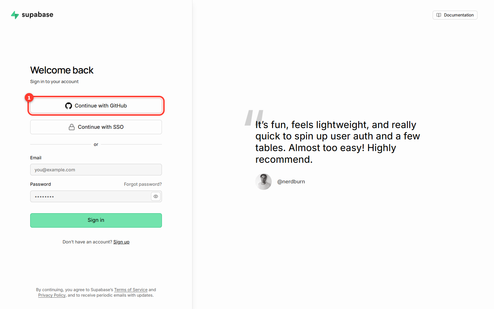
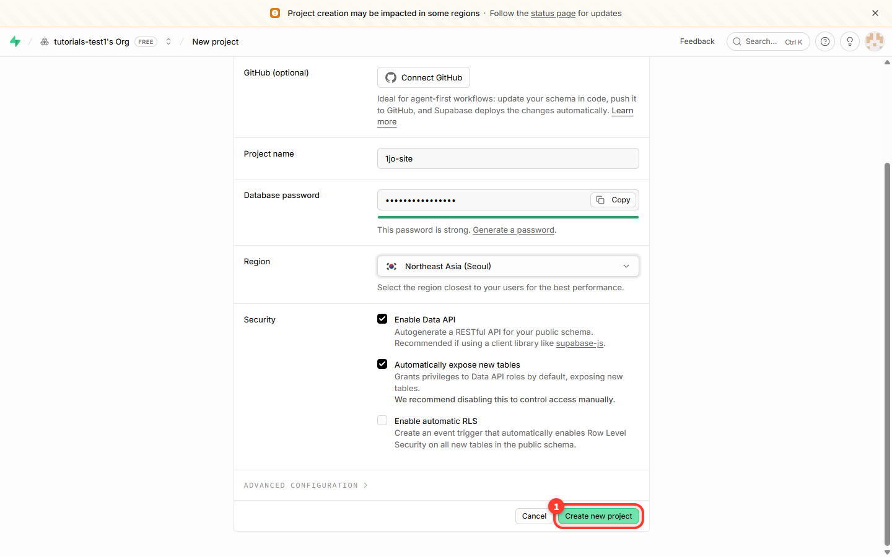
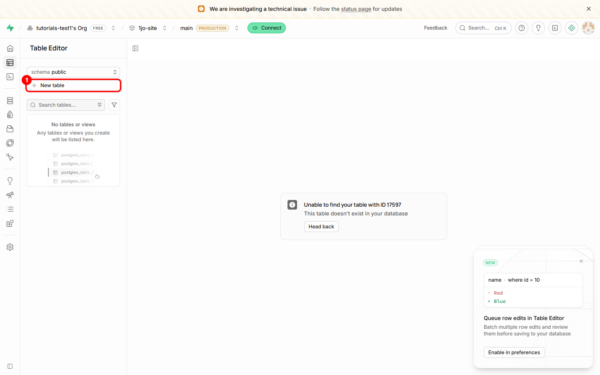
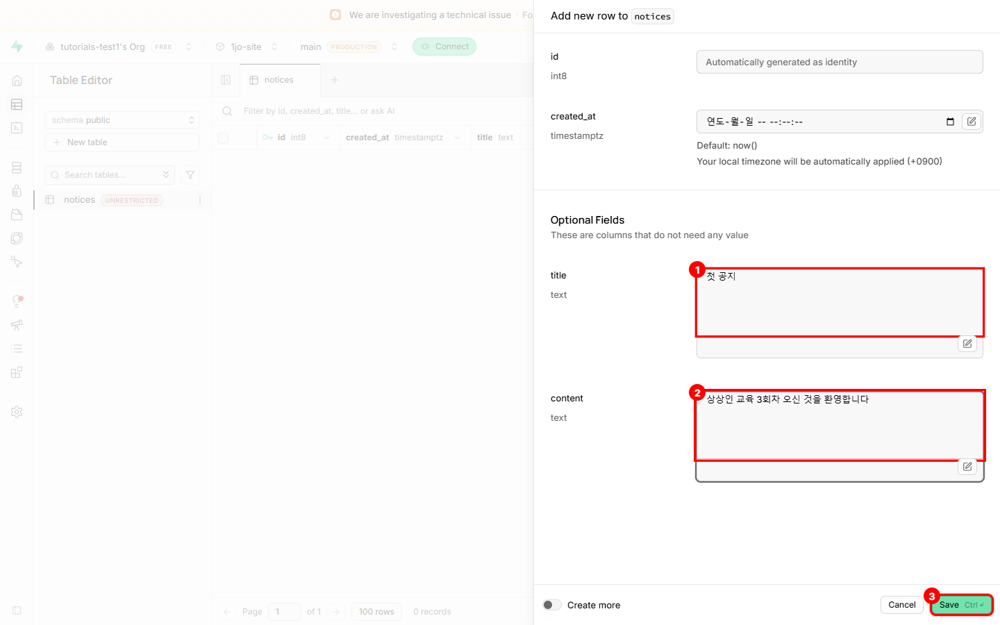
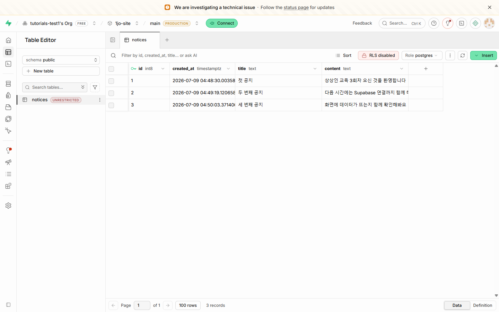
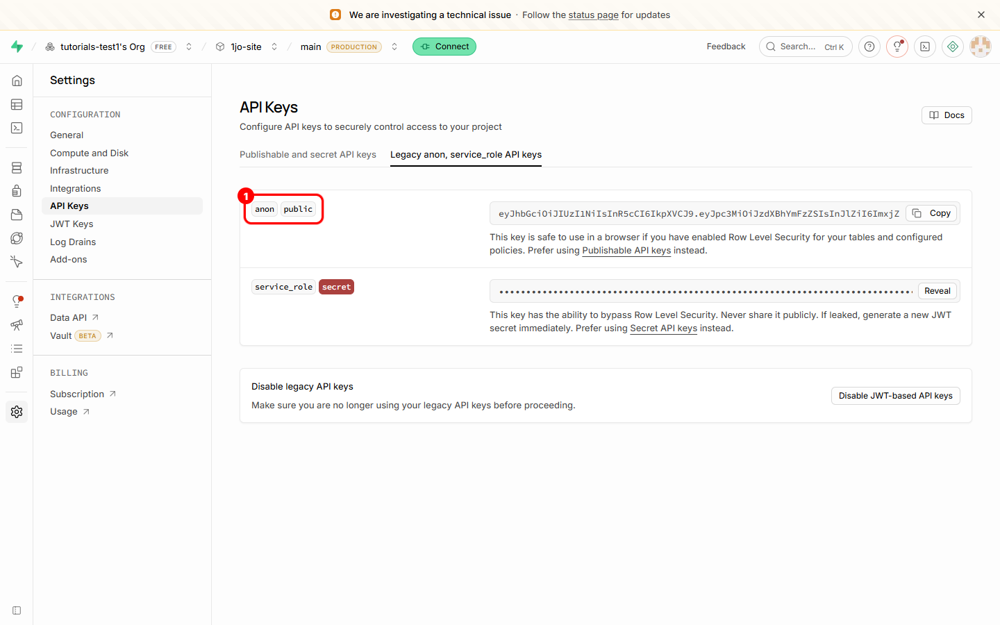
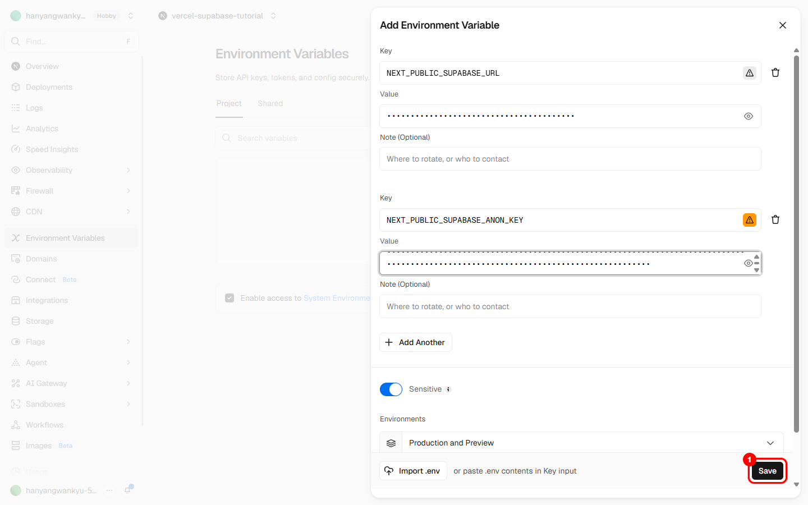
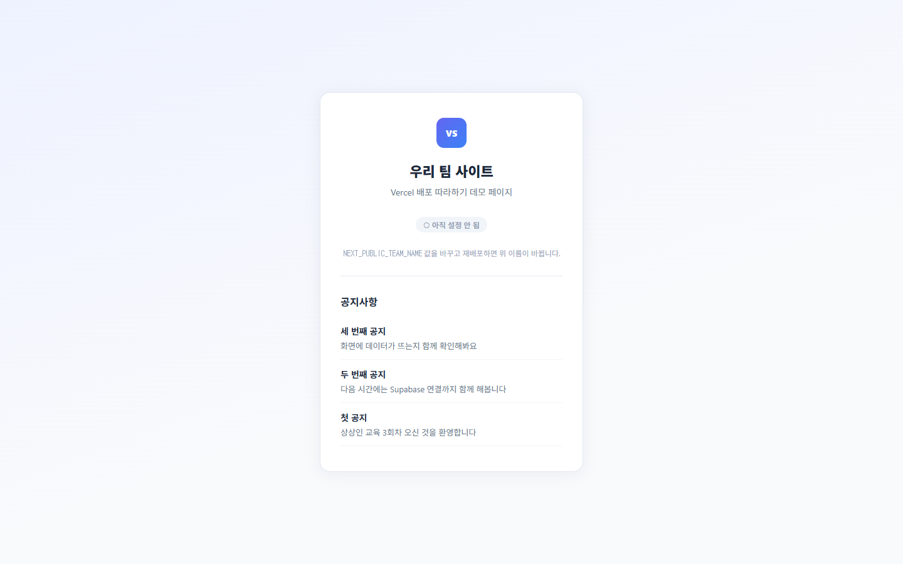

# Supabase 따라하기 (비개발자용)

배포한 우리 사이트에 **데이터 저장소를 연결해, 우리가 넣은 데이터가 화면에 나오게** 하는 과정을 화면 그대로 따라가며 끝내는 안내서입니다. 코드를 몰라도 됩니다. 화면의 버튼을 순서대로 누르고, 강사가 준 코드 조각에서 이름 몇 개만 바꾸면 됩니다.

- **Supabase** = 데이터를 보관하는 곳 (표/테이블 = 엑셀 시트 한 장이라고 생각하면 됩니다)
- **Vercel** = 우리 사이트를 인터넷에 올려둔 곳 ([Vercel 배포 따라하기](Vercel-배포-따라하기.md)에서 이미 완료)
- 이 문서의 목표: Supabase에 우리 표를 만들고 데이터를 몇 줄 넣은 뒤, 그 **연결 정보(주소·열쇠)를 환경변수로** 사이트에 이어 붙여, **화면에 우리 데이터가 뜨는 것**까지.

> **먼저 끝나 있어야 하는 것**: [Vercel 배포 따라하기](Vercel-배포-따라하기.md)의 8단계까지 완료(사이트가 `주소.vercel.app`으로 떠 있고, 환경변수 넣는 자리를 알고 있음). 이 문서는 그 다음입니다.

> **참고**: 아래 화면의 프로젝트 이름·지역·계정 이름은 예시입니다. 여러분 화면에는 **여러분이 정한 값**이 보입니다. 단계와 버튼 위치는 같습니다.

---

## 준비물

- **Supabase 계정** (이메일 또는 GitHub로 가입 — 무료로 시작 가능)
- **1교시에 적은 데이터 항목 목록** (예: 공지사항이면 제목 / 내용 / 작성일) — 이게 그대로 표의 열이 됩니다
- **배포된 팀 사이트** (Vercel 따라하기 완료 상태)
- **강사가 주는 코드 조각**(스니펫) — 6단계에서 붙여넣습니다
- 웹 브라우저 (크롬 권장)

전체 흐름은 이렇게 7단계입니다.

```
0. Supabase 로그인  →  1. 프로젝트 만들기  →  2. 표(테이블) 만들기
   →  3. 데이터 몇 줄 넣기  →  4. 연결 정보 복사  →  5. 환경변수에 넣기
   →  6. 코드 조각 붙여넣기  →  7. 화면에서 데이터 확인
```

---

## 0단계 — Supabase 로그인 (가입)

1. 브라우저에서 **https://supabase.com** 에 접속합니다.
2. **Start your project** 또는 **Sign In** → **Continue with GitHub**(GitHub로 계속)를 누릅니다.
3. GitHub 로그인 창이 뜨면 여러분의 GitHub 계정으로 로그인·허용합니다.



> GitHub로 가입하면 Vercel 때 쓴 계정과 같아 헷갈리지 않습니다. 이메일 가입도 가능합니다.

---

## 1단계 — 프로젝트 만들기 (New Project)

**프로젝트** = 우리 팀의 데이터가 담길 하나의 상자입니다. 팀마다 하나씩 만듭니다.

1. 대시보드에서 **New Project**(새 프로젝트)를 누릅니다. (조직(Organization)을 먼저 고르라고 하면 있는 것 하나를 고르거나 새로 만듭니다.)
2. 입력칸을 채웁니다.
   - **Name**(이름): 팀 이름 등 알아보기 쉬운 이름 (예: `1jo-site`)
   - **Database Password**(데이터베이스 비밀번호): 자동 생성 버튼을 눌러도 됩니다. **반드시 메모해 둡니다.**
   - **Region**(지역): 가까운 곳 — **Northeast Asia (Seoul)** 권장



3. **Create new project**(프로젝트 생성)를 누릅니다. 준비되는 데 **1~2분** 걸립니다.

> **중요**: Database Password는 나중에 찾기 어렵습니다. 팀 메모장에 적어 두세요. (이 데모에서 직접 쓰진 않지만 분실하면 곤란합니다.)

---

## 2단계 — 표(테이블) 만들기

**표(테이블)** = 엑셀 시트 한 장입니다. 1교시에 적은 데이터 항목이 그대로 **열(column)**이 됩니다.

1. 왼쪽 메뉴에서 **Table Editor**(표 편집기)로 들어가 **New table**(새 표)를 누릅니다.
2. 표 이름과 열을 정합니다. 예를 들어 공지사항이라면:
   - **Name**(표 이름): `notices` (영어 소문자)
   - 열 추가:

| 열 이름 (Name) | 자료형 (Type) | 설명 |
|----------------|---------------|------|
| `id` | int8 | 자동 번호 (기본으로 있음, 그대로 둠) |
| `title` | text | 제목 (글자) |
| `content` | text | 내용 (글자) |
| `created_at` | timestamptz | 작성일 (기본으로 있음, 그대로 둠) |



3. **Save**(저장)를 누릅니다.

> **강사 포인트**: 열 이름은 **영어 소문자**로 (예: `title`). 6단계 코드에서 이 이름을 그대로 씁니다 — 한글이나 띄어쓰기를 넣으면 나중에 막힙니다.

> **RLS(공개 권한) 안내**: 표를 만들 때 **Enable Row Level Security**가 켜져 있으면, 기본적으로는 바깥에서 데이터를 못 읽습니다. 이 데모에서는 **누구나 읽기(조회)만 가능한 공개 정책**을 하나 켜줘야 화면에 데이터가 보입니다 → 아래 6단계 뒤 "자주 막히는 곳" 참고. 잘 모르겠으면 강사에게 "읽기 공개 정책" 요청.

---

## 3단계 — 데이터 몇 줄 넣기

표가 비어 있으면 화면에도 아무것도 안 나옵니다. 손으로 2~3줄 넣어봅니다.

1. 방금 만든 표(`notices`)를 연 상태에서 **Insert → Insert row**(행 추가)를 누릅니다.
2. `title`, `content` 칸을 채웁니다. (`id`·`created_at`은 비워두면 자동으로 채워집니다.)
   - 예: title = `첫 공지`, content = `상상인 교육 3회차 오신 것을 환영합니다`
3. **Save**로 저장하고, 2~3줄 더 반복합니다.





> 데이터가 표에 쌓이는 걸 눈으로 확인하세요. 이 데이터가 곧 사이트 화면에 그대로 나옵니다.

---

## 4단계 — 연결 정보 복사 (Project URL + API Key)

사이트가 이 표를 읽으려면 **주소(URL)**와 **열쇠(API Key)** 두 개가 필요합니다.

1. 왼쪽 아래 **Settings → API**(또는 **Project Settings → API**)로 들어갑니다.
2. 두 값을 확인합니다.
   - **Project URL**: `https://xxxxxxxx.supabase.co` 형태
   - **anon public** 키: `Project API Keys` 항목의 **anon / public** 값 (긴 문자열)



> **anon public 키만** 씁니다. 그 아래 **service_role** 키는 관리자용 비밀 키라 **절대 사이트/코드에 넣지 않습니다.** 이름에 `anon`(익명)이 있는 것만 복사하세요.

---

## 5단계 — 환경변수에 넣기 (Vercel)

복사한 두 값을 **코드에 직접 쓰지 않고** Vercel 환경변수에 넣습니다. (Vercel 따라하기 5단계에서 익힌 그 자리입니다.)

1. Vercel에서 우리 프로젝트 → **Settings → Environment Variables**로 들어갑니다.
2. 값 두 개를 각각 추가합니다.

| Key (이름) | Value (값) |
|------------|------------|
| `NEXT_PUBLIC_SUPABASE_URL` | 4단계의 **Project URL** |
| `NEXT_PUBLIC_SUPABASE_ANON_KEY` | 4단계의 **anon public** 키 |



3. 각각 **Save**(저장)를 누릅니다.

> **중요**: 이름의 철자가 한 글자라도 다르면 화면에 데이터가 안 나옵니다. `NEXT_PUBLIC_` 접두사까지 **그대로** 복사하세요. (강사가 준 코드가 이 이름을 찾습니다.)

> 환경변수는 **저장만으로는 반영되지 않습니다.** 7단계에서 재배포해야 적용됩니다. (Vercel 따라하기 6단계와 동일.)

---

## 6단계 — 코드 조각 붙여넣기

강사가 준 **코드 조각(스니펫)**을 사이트 코드에 붙여넣고, **표 이름·열 이름만** 팀 것으로 바꿉니다. 아래는 예시입니다(공지사항 `notices` 기준).

```js
// lib/supabase.js — Supabase에 연결하는 코드 (강사 제공, 그대로 사용)
import { createClient } from '@supabase/supabase-js'

export const supabase = createClient(
  process.env.NEXT_PUBLIC_SUPABASE_URL,      // 5단계에서 넣은 주소
  process.env.NEXT_PUBLIC_SUPABASE_ANON_KEY  // 5단계에서 넣은 열쇠
)
```

```jsx
// 화면에서 데이터를 불러와 목록으로 보여주는 부분 (표/열 이름만 팀 것으로 교체)
import { supabase } from '@/lib/supabase'

export default async function Page() {
  // 'notices' ← 우리 표 이름으로 바꾸기
  const { data: notices } = await supabase.from('notices').select('*')

  return (
    <ul>
      {notices?.map((n) => (
        // n.title, n.content ← 우리 열 이름으로 바꾸기
        <li key={n.id}>
          <strong>{n.title}</strong> — {n.content}
        </li>
      ))}
    </ul>
  )
}
```

바꿀 곳은 **세 군데뿐**입니다.

| 바꿀 것 | 예시 값 | 우리 팀 값 |
|---------|---------|-----------|
| 표 이름 | `notices` | (2단계에서 정한 표 이름) |
| 열 이름 1 | `title` | (우리 열 이름) |
| 열 이름 2 | `content` | (우리 열 이름) |

> **강사 포인트**: 처음이면 강사·외부 인원이 Claude로 코드 생성을 함께 도와줍니다. 무엇을 하는 코드인지 한 줄로 설명 듣고, **이름 세 개만** 우리 것으로 바꾸는 데 집중하세요.

바꾼 코드를 **GitHub에 올리면(push)** Vercel이 자동으로 다시 배포합니다. (Vercel 따라하기 보너스와 동일.)

---

## 7단계 — 화면에서 데이터 확인

1. 5단계에서 환경변수만 바꿨고 코드는 안 바꿨다면, Vercel **Deployments → ⋯ → Redeploy**로 재배포합니다. (6단계에서 코드를 push했다면 자동 배포가 이미 돌고 있습니다.)
2. 1~2분 기다린 뒤 사이트 주소를 새로고침합니다.
3. 3단계에서 넣은 데이터가 **화면에 목록으로** 보이면 성공입니다.



여기까지 왔으면 오늘의 핵심 체크포인트(5교시)를 통과한 것입니다. 우리가 만든 표의 데이터가 인터넷 사이트에 실제로 나온 것입니다.

---

## 자주 막히는 곳 (체크리스트)

화면에 데이터가 안 나오면 **아래 순서대로** 점검하세요.

| 순서 | 증상 | 원인 | 해결 |
|------|------|------|------|
| 1 | 화면에 아무것도 안 나옴 | 환경변수 **철자** 오타 | `NEXT_PUBLIC_SUPABASE_URL` / `NEXT_PUBLIC_SUPABASE_ANON_KEY` 이름을 1:1로 대조 |
| 2 | 여전히 빈 화면 | 표 이름 / 열 이름 **불일치** | 코드의 `from('...')`·`n.열이름`이 Supabase 표·열 이름과 정확히 같은지 확인 |
| 3 | `permission denied` 류 오류 | **RLS(행 보안)** 공개 조회 정책 없음 | 아래 "읽기 공개 정책" 참고 (또는 강사에게 요청) |
| 4 | 로컬은 되는데 배포만 실패 | 환경변수가 **Vercel에만 없음** | Vercel Settings에 같은 값이 있는지 확인 후 재배포 |
| 5 | 값을 넣었는데 그대로 | **재배포 안 함** | 7단계 재배포 |

### 읽기 공개 정책 (RLS) — 3번 증상일 때

Supabase는 기본적으로 바깥에서의 읽기를 막아둡니다. 이 데모에서는 **누구나 조회만 가능**하게 열어줍니다.

1. Supabase → **Authentication → Policies**(또는 Table Editor의 표에서 **RLS policies**)로 갑니다.
2. 우리 표(`notices`)에 **New Policy → 조회(SELECT) 허용** 정책을 추가합니다. 템플릿 중 **Enable read access for all users**(모두 읽기 허용)를 고르면 간단합니다.
3. 저장 후 사이트를 새로고침합니다.

> 이건 "데모라서 데이터를 공개로 읽게" 하는 설정입니다. 비밀번호·개인정보 같은 민감한 데이터는 이렇게 열지 않습니다 — 실제 서비스에서는 로그인한 사람만 읽게 정책을 좁힙니다.

---

## 강사 메모

- 본 문서는 [Curriculum.md](Curriculum.md) **4교시(데이터 저장소 설계)** + **5교시(사이트-데이터 연결)**를 비개발자용 "따라하기"로 풀어낸 것입니다. 앞 단계(배포·환경변수)는 [Vercel 배포 따라하기](Vercel-배포-따라하기.md).
- **핵심 체크포인트: 7단계(데이터 화면 표시)** — 5교시 체크포인트와 동일. 데이터가 한 줄이라도 뜨면 크게 격려해 6교시 동력으로 잇습니다.
- **가장 자주 막히는 3대 지점** 순서 고정: (1) 환경변수 철자 → (2) 표/열 이름 일치 → (3) RLS 공개 정책. 체크리스트를 이 순서로 짚으면 대부분 잡힙니다.
- 6단계 스니펫은 팀 프레임워크(예: Next.js)에 맞춰 강사가 조정해 배포. 수강생은 **표/열 이름 교체**에만 집중하도록 안내.
- `anon public`과 `service_role` 키 혼동 주의 — service_role은 절대 사이트/코드/환경변수 공개 노출 금지.
