# Vercel 배포 따라하기 — MCP 버전 (비개발자용)

[Vercel 배포 따라하기](Vercel-배포-따라하기.md)와 **목표가 똑같은 문서**입니다. 다른 점은 **대시보드에서 버튼을 누르는 대신 Claude Code 창에 말로 요청**한다는 것입니다.

> **먼저 알아둘 것**: 배포의 **처음 한 번**은 웹 화면에서 해야 합니다. GitHub 계정을 Vercel에 연결하고 권한을 허용하는 단계는 자동화할 수 없습니다. 그 뒤부터 — 환경변수 넣기, 재배포, 오류 확인 — 가 대화로 됩니다.

> 그래서 이 문서는 **웹 버전의 0~3단계를 그대로 참조**하고, 4단계 이후를 MCP 방식으로 다룹니다. 웹 버전을 옆에 열어두세요.

---

## 준비물

- **Claude Code**가 설치되어 실행되는 상태 (1회차에서 준비 완료)
- **팀 프로젝트 폴더**에서 Claude Code를 열어둔 상태
- **GitHub 계정** — 저장소는 2단계에서 강사 저장소를 복사해 직접 만듭니다
- **강사 저장소 주소** — `https://github.com/tutorials-test1/Sangsangin_3_vercel_sample.git` (2단계에서 내 계정으로 복사할 원본)
- **Vercel 계정** (GitHub으로 가입)

전체 흐름입니다. 앞 절반은 웹, 뒤 절반이 MCP입니다.

```
[웹으로] 0. Vercel 로그인 → 1. GitHub 연결·앱 설치 → 2. 내 저장소 만들기(미러링) → 3. 가져오기·배포
[대화로] 4. 통로 열기 → 5. 환경변수 넣기 → 6. 재배포 → 7. 확인 → (막히면) 8. 오류 진단
```

---

## 0단계 — Vercel 로그인 (GitHub로 가입)

0~3단계는 **웹 화면에서** 합니다. 계정 만들기와 저장소 연결은 사람이 직접 허락해줘야 하는 일이라 자동화되지 않습니다. 4단계부터 Claude Code로 넘어옵니다.

1. 브라우저에서 **https://vercel.com** 에 접속합니다.
2. **Sign Up**(가입) 또는 **Log In**(로그인) → **Continue with GitHub**를 누릅니다.
3. GitHub 로그인 창이 뜨면 여러분의 GitHub 계정으로 로그인합니다.

> 처음이면 자동으로 회원가입이 됩니다. GitHub로 가입하면 다음 단계의 연결도 수월합니다.

---

## 1단계 — GitHub 연결 + Vercel 앱 설치 (가장 많이 막히는 곳)

Vercel이 우리 GitHub 저장소를 가져오려면, **"Vercel이 내 GitHub를 봐도 된다"고 한 번 허락**해줘야 합니다. 이 허락이 안 돼 있으면 다음 단계에서 저장소가 안 보이거나 빨간 경고가 뜹니다.

1. 새 프로젝트를 만들기 위해 **Add New… → Project**로 들어갑니다.

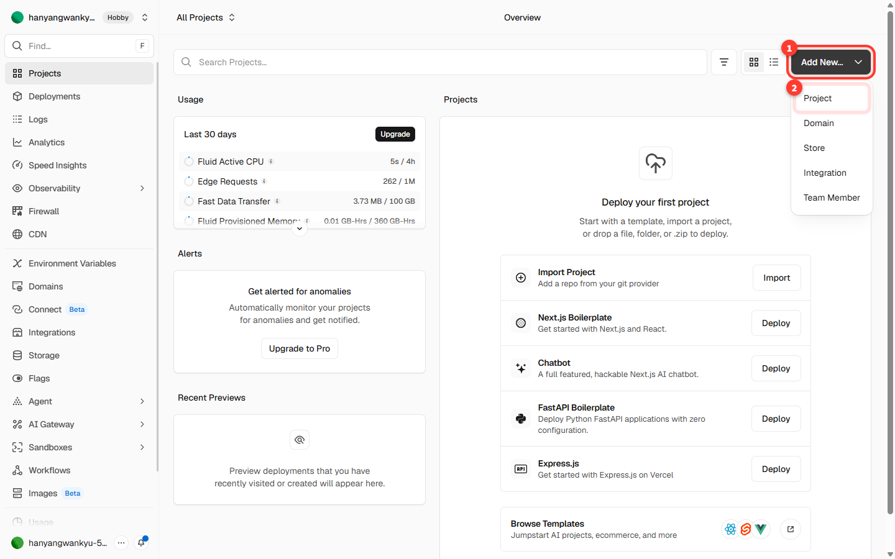
*① Add New… 버튼 → ② Project 선택*

2. **Import Git Repository**(Git 저장소 가져오기) 영역에서 **Continue with GitHub**를 누릅니다.


*Git 제공자 연결 화면*

3. GitHub 화면으로 넘어가면 **Install / Authorize Vercel**(설치·허용)을 누릅니다.
   - 저장소 접근 범위는 **All repositories**(전체) 또는 **Only select repositories**(특정 저장소만) 중 하나를 고릅니다.

> **자주 나는 함정**: 저장소를 가져오려 할 때 **"To link a GitHub repository, you need to install the GitHub integration first"** 라는 빨간 경고가 보이면, 그 저장소가 있는 계정(개인 계정 또는 조직)에 **Vercel 앱이 아직 설치 안 된 것**입니다. 위 1~3번처럼 그 계정에 Vercel을 한 번 설치하면 해결됩니다. **이 경고는 MCP로도 해결되지 않습니다.**


*설치가 필요하다는 경고*

---

## 2단계 — 내 저장소 만들기 (미러링)

강사가 만들어 둔 튜토리얼 저장소를 **통째로 복사해서 내 저장소로 만드는** 과정입니다. 이걸 **미러링(mirroring)**이라고 합니다. Vercel은 **내 저장소**만 가져올 수 있고, 앞으로 코드를 고치려면 내 것이어야 하기 때문입니다.

1. GitHub 홈에서 왼쪽 위 초록색 **New**(새로 만들기) 버튼을 누릅니다.


*① 초록색 New 버튼*

2. **Repository name**(저장소 이름)에 `vercel-test` 를 입력합니다. **이름은 `vercel-test` 로 맞춰주세요.**
3. 나머지 설정은 그대로 두고, 맨 아래 **Create repository**(저장소 만들기)를 누릅니다.

> **Add README·.gitignore·license는 켜지 마세요.** 완전히 비어 있는 저장소여야 다음 단계의 복사가 깔끔하게 들어갑니다.


*① 저장소 이름은 vercel-test ② Create repository 버튼*

4. 저장소가 만들어지면 안내 화면이 나옵니다. 여기 있는 **HTTPS 주소**를 복사합니다. 이게 **내 저장소 주소**입니다.


*① 복사할 내 저장소 주소*

5. Claude Code에 **강사 저장소 주소**와 **방금 복사한 내 저장소 주소**를 함께 주고, 복사(미러링)해 달라고 요청합니다.

```
아래 저장소를 내 저장소로 그대로 복사해줘.
가져올 곳: https://github.com/tutorials-test1/Sangsangin_3_vercel_sample.git
넣을 곳: (방금 복사한 내 저장소 주소)
```


*① 강사가 만든 원본 저장소 (가져올 곳) ② 내가 방금 만든 저장소 (넣을 곳)*

> **두 주소를 헷갈리지 마세요.** **위**가 강사가 만든 **원본**(가져올 곳), **아래**가 방금 만든 **내 저장소**(넣을 곳)입니다. 순서가 바뀌면 엉뚱한 저장소를 덮어쓰게 됩니다.

6. 끝나면 내 저장소 페이지를 새로고침합니다. 파일 목록과 **브랜치·커밋**이 원본 그대로 들어와 있으면 성공입니다.


*① 브랜치와 ② 커밋이 원본 그대로 복사됨*

---

## 3단계 — 프로젝트 가져오기 (Import) + 배포

1. Vercel에서 **Add New… → Project**로 들어가면 **Import Git Repository** 목록에 방금 만든 `vercel-test`가 보입니다.

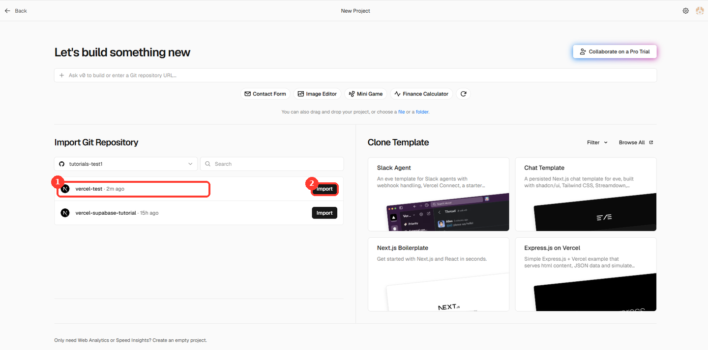
*① 미러링한 vercel-test 저장소 ② Import 버튼*

> 목록에 `vercel-test`가 안 보이면 1단계의 **Vercel 앱 설치·접근 권한**이 그 계정에 안 돼 있는 것입니다. 1단계로 돌아가 설치하거나, 접근 범위에 `vercel-test`를 추가해 주세요.

2. `vercel-test` 오른쪽의 **Import**(가져오기)를 누릅니다.
3. 설정 화면은 **대부분 그대로 두면 됩니다.** (Project Name·Application Preset·Root Directory 모두 기본값)

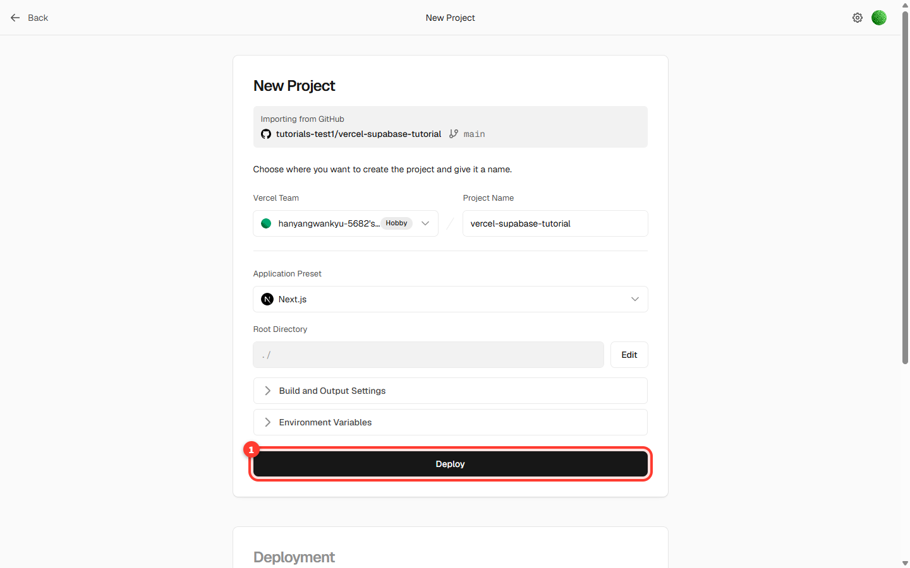
*프로젝트 설정 화면*

4. 맨 아래 **Deploy**(배포)를 누릅니다. 빌드에 **1~2분** 걸립니다.


*배포 진행 중*

5. 끝나면 **Congratulations!** 화면이 나옵니다. **Continue to Dashboard**를 눌러 우리 사이트 주소 `...vercel.app` 을 확인합니다.


*배포 성공 화면*


*프로젝트 대시보드 — 여기서 사이트 주소를 확인합니다*

> 지금 사이트를 열면 팀 이름이 **"우리 팀 사이트"**라는 기본값으로 보입니다. 5단계에서 환경변수를 넣어 바꿉니다. **여기까지가 웹 화면에서 하는 전부입니다.**

---

## 4단계 — 통로 열기 (MCP 연결)

한 번만 하면 됩니다.

1. Claude Code 창에 아래를 입력합니다.

```
claude mcp add --transport http --scope user vercel https://mcp.vercel.com
```

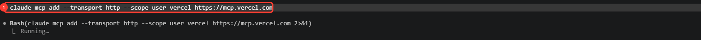
*① 그대로 입력할 명령어*

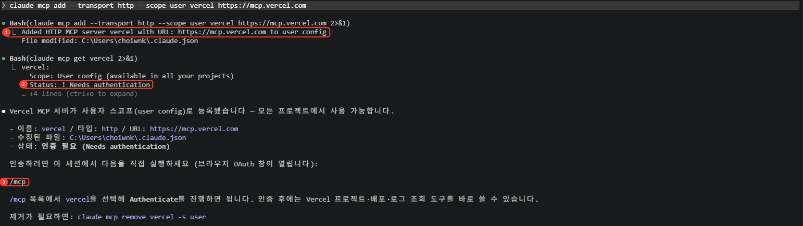
*① 등록 성공 ② 아직 인증 전 상태 ③ 다음에 입력할 `/mcp`*

2. Claude Code를 종료하고 **`claude --continue`로 다시 시작**합니다. (그냥 `claude`로 시작하면 대화 내용이 사라집니다.)

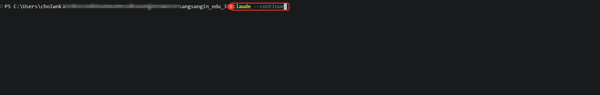
*① 대화를 이어서 다시 시작하는 명령어*

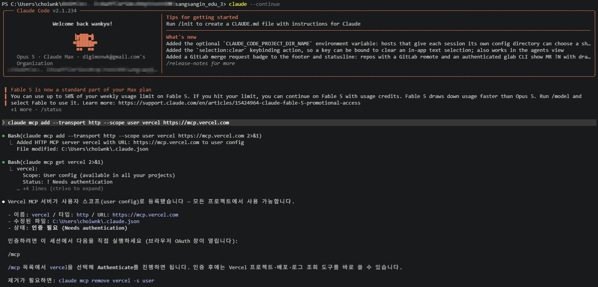
*다시 시작해도 앞서 주고받은 내용이 그대로 남아 있습니다 — `--continue`를 빼면 이 부분이 사라집니다*

3. `/mcp`를 입력하고 목록에서 **`vercel`**을 고릅니다.

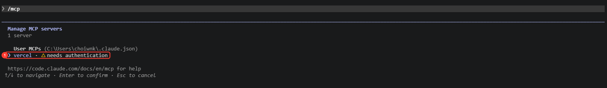
*① 아직 인증이 안 된 vercel — Enter로 선택*

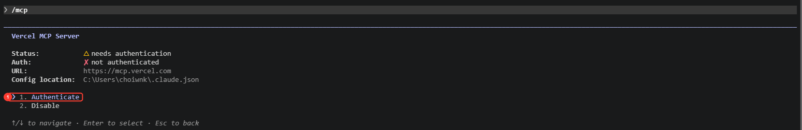
*① **Authenticate**를 선택하면 브라우저가 열립니다*

4. 브라우저가 열리면 Vercel 계정으로 **허용(Authorize)**을 누릅니다.

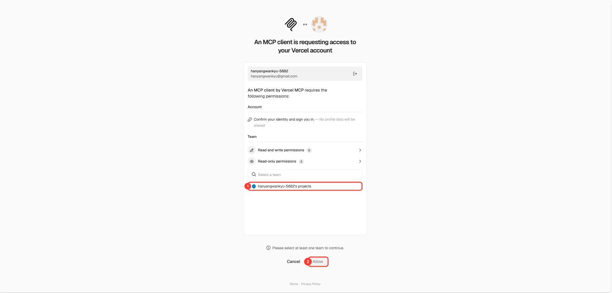
*① 팀을 먼저 골라야 합니다 ② 고르기 전에는 Allow가 눌리지 않습니다*

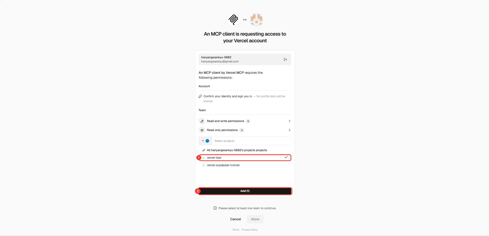
*① 연결할 프로젝트를 고르고 ② Add를 누릅니다*

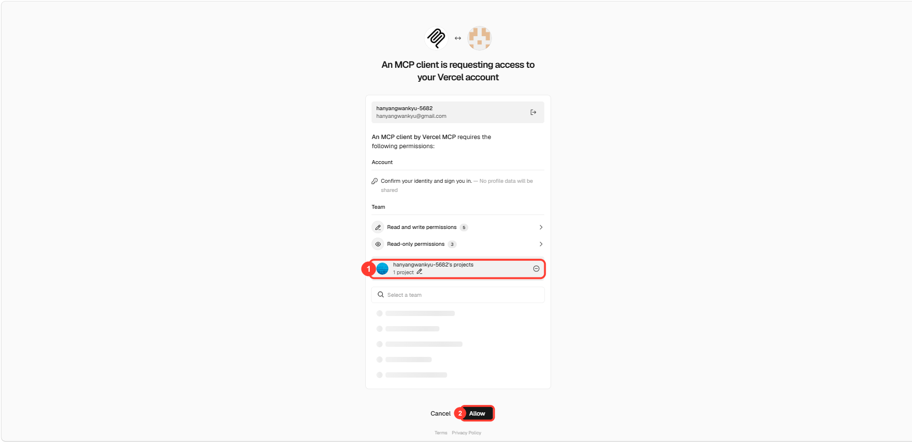
*① 팀이 추가되면 ② Allow가 활성화됩니다*

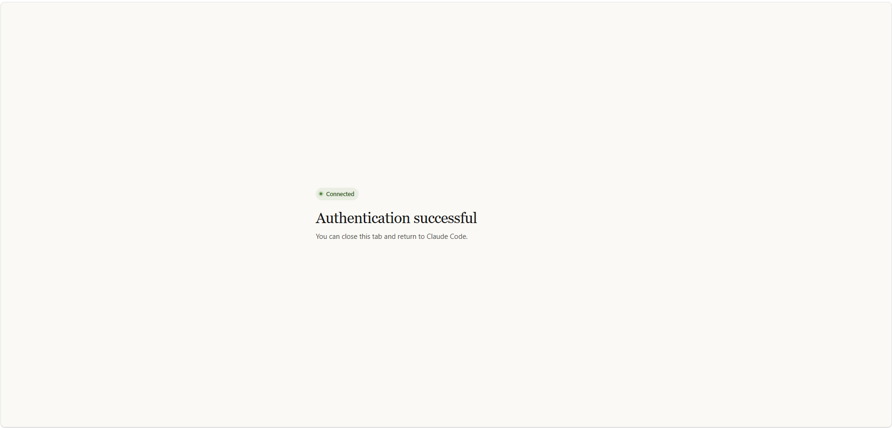
*브라우저에 이 화면이 나오면 탭을 닫고 Claude Code로 돌아갑니다*

5. `Connected`가 나오면 성공입니다.

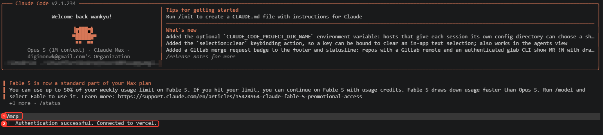
*① `/mcp` ② **Connected** — 여기까지 나오면 통로가 열린 것입니다*

> **목록에서 이름 찾기**: `claude.ai Supabase`처럼 `claude.ai`가 붙은 것들과 달리, 이건 그냥 **`vercel`**로 목록 **맨 아래**에 보입니다.

한 가지 더 — 환경변수를 넣으려면 **명령줄 로그인**도 필요합니다. 아래를 한 번 실행하고 브라우저에서 허용하세요.

```
npx vercel login
```

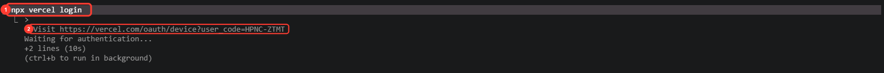
*① 입력할 명령어 ② 브라우저로 열 주소 — 뒤에 붙은 코드를 확인해 둡니다*

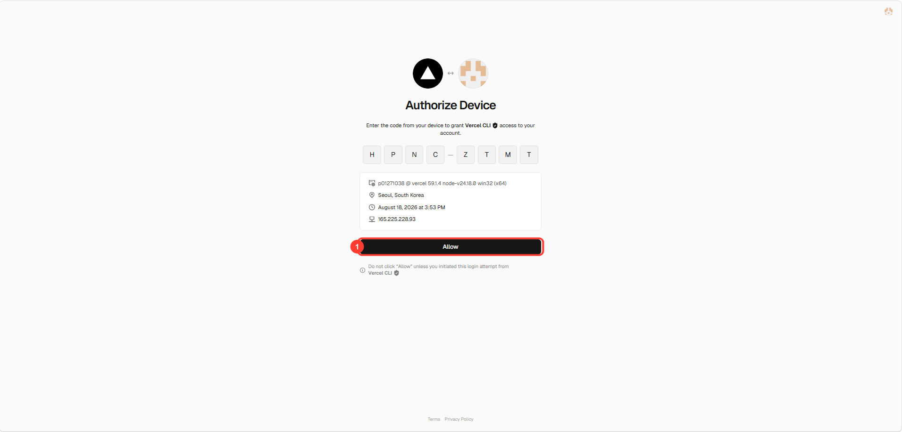
*터미널에 나온 코드가 그대로 들어가 있는지 확인하고 ① Allow*

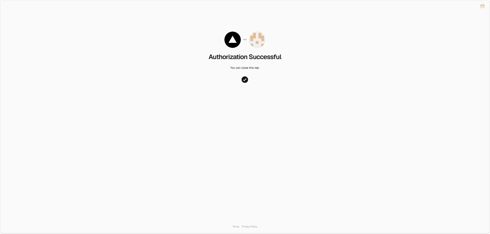
*이 화면이 나오면 탭을 닫아도 됩니다*

> **왜 두 번 로그인하나요?** Vercel MCP는 배포 상태·오류 로그를 **읽는** 데 쓰이고, 환경변수를 **넣는** 기능은 MCP에 없어서 명령줄 도구를 씁니다. Claude가 두 가지를 알아서 나눠 쓰니 여러분은 로그인만 해두면 됩니다.

---

## 5단계 — 환경변수 넣기

웹 버전에서 가장 오타가 많이 나는 구간입니다. 이름 한 글자만 틀려도 화면에 아무것도 안 나옵니다.

넣기 전 사이트는 이런 상태입니다.

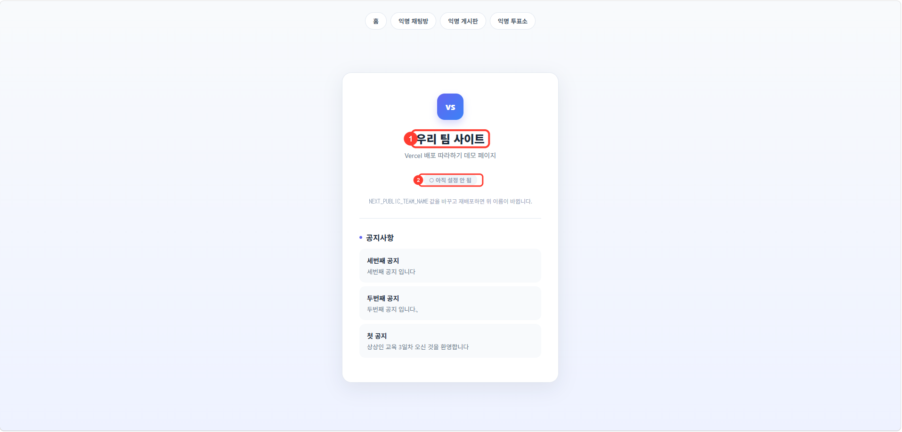
*① 아직 기본값인 팀 이름 ② "아직 설정 안 됨" 표시*

Supabase까지 연결하는 경우라면 [Supabase 따라하기 (MCP 버전)](Supabase-따라하기-MCP.md)의 4단계처럼 한 줄로 끝납니다.

```
우리 supabase 주소랑 열쇠를 vercel 환경변수에 넣어줘
```

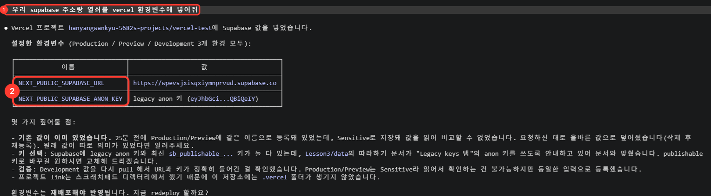
*① 이렇게 말하면 ② 두 값이 자동으로 등록됩니다 — 손으로 옮기지 않으니 오타가 없습니다*

값을 직접 정하는 환경변수라면 이렇게 말합니다.

```
vercel 환경변수에 NEXT_PUBLIC_TEAM_NAME을 1조로 넣어줘
```

Claude가 등록하고 확인해 줍니다.

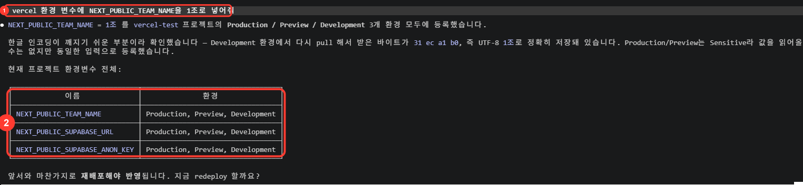
*① 이렇게 말하면 ② 지금 들어가 있는 환경변수를 표로 보여줍니다*

들어간 값을 확인하려면 이렇게 물어보세요. (값 자체는 가려져 나옵니다 — 정상입니다.)

```
지금 환경변수 뭐가 들어가 있어?
```

> **사람이 값을 옮기지 않으므로 철자 오타가 생기지 않습니다.** 웹 버전 "자주 막히는 곳"의 1·4번(환경변수 철자, Vercel에만 없음)이 여기서 사라집니다.

---

## 6단계 — 재배포

환경변수는 **저장만으로는 화면에 반영되지 않습니다.** 다시 배포해야 합니다. 웹 버전에서 가장 자주 잊는 단계입니다.

```
다시 배포해줘
```

```
production 배포를 시작했습니다. 1~2분 걸립니다.
```

코드를 바꿨다면 재배포를 따로 부탁할 필요가 없습니다. GitHub에 올리면 Vercel이 자동으로 다시 배포합니다. 1·2회차에서 쓰던 그 말이면 됩니다.

```
저장해줘
```

---

## 7단계 — 확인

```
배포 다 됐어?
```

```
Ready 상태입니다.
주소: https://우리프로젝트.vercel.app
```

사이트 주소를 새로고침해서 바뀐 내용이 보이면 성공입니다.

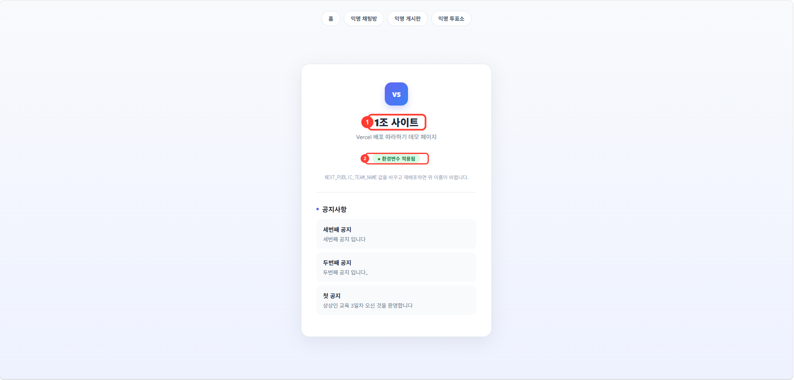
*① 팀 이름이 바뀌었고 ② "환경변수 적용됨"으로 표시가 바뀌었습니다*

> **다른 사람에게 보여줄 때 로그인 화면이 뜨면** 배포 보호(Deployment Protection)가 켜진 것입니다. `배포 보호 설정 어떻게 되어 있어?`라고 물어보세요. 켜져 있으면 소유자만 볼 수 있어 8교시 발표 때 곤란합니다. 강사에게 해제를 요청하세요.

---

## 8단계 — 막혔을 때 (MCP 버전의 가장 큰 장점)

웹 버전에서는 배포가 실패하면 Vercel 대시보드를 열고 로그를 찾아 영어 오류 메시지를 읽어야 합니다. MCP 버전에서는 이렇게 물어보면 됩니다.

```
배포 왜 실패했어?
```

Claude가 빌드 기록을 직접 읽고 원인을 쉬운 말로 알려줍니다. 실제 예를 하나 보여드립니다. 이 교육 자료를 준비하면서 실제로 났던 오류입니다.

```
빌드가 이 오류로 멈췄습니다.

  Module not found: Can't resolve '@/lib/supabase'

원인: 프로젝트에 TypeScript 파일이 하나 있어서 Next.js가 빌드 중
tsconfig.json을 자동으로 만듭니다. 그런데 자동 생성된 파일에는
경로 별칭(@/) 설정이 빠져 있고, 이 파일이 있으면 기존
jsconfig.json 설정은 무시됩니다. 그래서 '@/lib/supabase'를
찾지 못합니다.

고치려면 tsconfig.json에 별칭 설정을 넣고 저장소에 포함시켜야
합니다. 진행할까요?
```

이 오류는 **첫 빌드는 성공하고 두 번째부터 실패**하는 종류여서, 로그를 직접 읽어도 원인을 짚기 어렵습니다. 웹 버전이라면 강사를 불러야 하는 상황입니다.

이런 것도 물어볼 수 있습니다.

```
우리 사이트 지금 잘 떠 있어?
최근 배포 목록 보여줘
사이트에서 에러 나고 있어?
```

---

## 자주 막히는 곳 (체크리스트)

| 순서 | 증상 | 이렇게 말하세요 |
|------|------|-----------------|
| 1 | 화면이 안 바뀜 | `다시 배포해줘` — 재배포 누락이 가장 흔함 |
| 2 | 값을 넣었는데 그대로 | `환경변수 뭐가 들어가 있어?` |
| 3 | 배포가 빨간 글씨로 실패 | `배포 왜 실패했어?` |
| 4 | 사이트가 열리는데 오류 화면 | `사이트에서 에러 나고 있어?` |
| 5 | 남에게 링크 주면 로그인 화면 | `배포 보호 설정 어떻게 되어 있어?` |
| 6 | GitHub 저장소를 못 가져옴 | **웹 버전 1단계** — MCP로 해결 안 됨 |

6번만 웹으로 돌아가야 하고, 나머지는 대화로 처리됩니다.

---

## 안전하게 쓰기

Vercel MCP는 기본값으로 **계정 전체**를 봅니다. 팀이 여러 개면 프로젝트 하나로 범위를 좁히는 편이 안전합니다.

```
npx vercel mcp --project
```

또 이 통로에는 **도메인 구매** 같은 결제성 기능도 포함됩니다. `도메인 사줘` 같은 요청은 실제 결제로 이어질 수 있으니 쓰지 마세요.

---

## 웹 버전과 나란히 보기

| 웹 버전 단계 | MCP 버전 | 달라지는 점 |
|---|---|---|
| 0단계 Vercel 로그인 | 0단계 | 동일 (웹 화면에서 진행) |
| 1단계 GitHub 연결·앱 설치 | 1단계 | 동일 — **가장 많이 막히는 곳** |
| 2단계 내 저장소 만들기(미러링) | 2단계 | 동일 (복사 자체는 Claude가 대신 합니다) |
| 3단계 프로젝트 가져오기 | 3단계 | 동일 (웹 화면에서 진행) |
| 4단계 배포하기 | 3단계에 흡수 | Import 화면에서 이어서 누릅니다 |
| 5단계 배포 확인 | 3단계에 흡수 | 주소 확인까지 한 단계로 |
| 6단계 환경변수 넣기 | 5단계 | 손으로 붙여넣기(오타 빈발) → 한 문장 |
| 7단계 재배포 | 6단계 | 메뉴 3번 클릭 → `다시 배포해줘` |
| 8단계 결과 확인 | 7단계 | 동일 |
| (없음) | 8단계 | **오류 진단이 새로 생깁니다** |

---

## 강사 메모

- 본 문서는 [Vercel 배포 따라하기](Vercel-배포-따라하기.md)(웹 클릭 버전)의 **대체가 아니라 병행**입니다. [Curriculum.md](Curriculum.md) 2·3교시에 대응합니다.
- 같은 계열 MCP 문서: 4·5교시 [Supabase 따라하기 (MCP 버전)](Supabase-따라하기-MCP.md), 6교시 [로그인·글쓰기 붙이기 (MCP 버전)](Supabase-로그인-글쓰기-MCP.md).
- **0~3단계는 반드시 웹으로** — MCP로 대체 불가입니다. 특히 1단계(GitHub 앱 설치)는 웹 버전 문서의 빨간 경고 스크린샷을 그대로 활용하세요.
- **환경변수 등록은 Vercel MCP 기능이 아닙니다.** MCP 도구 목록에 환경변수 항목이 없어, Claude가 명령줄 도구(`vercel env add`)를 씁니다. 그래서 **`npx vercel login`이 선행 조건**입니다. 1교시에 함께 해두면 5단계가 매끄럽습니다.
- **8단계(오류 진단)가 이 문서의 실질적 가치입니다.** 7교시 "자주 나는 오류 일괄 해결"에서 강사 1명이 8개 팀 로그를 순회하는 부담이 크게 줄어듭니다. 빠른 팀은 스스로 진단하게 두고, 강사는 진짜 막힌 팀에 집중할 수 있습니다.
- **배포 보호를 확인해 두세요.** 웹 대시보드에서 만든 프로젝트는 배포 보호가 켜져 있을 수 있어, `.vercel.app` 주소가 소유자에게만 보입니다. 8교시 발표·공유 전에 팀별로 점검이 필요합니다. MCP로 만든 프로젝트는 기본 해제 상태입니다.
- **도메인 구매·요금제 변경 도구가 통로에 포함**됩니다. 수강생에게는 "도메인·결제 관련 요청은 하지 않기"를 명시적으로 안내하세요.
- 8단계의 예시 오류(`Can't resolve '@/lib/supabase'`)는 실제로 발생한 것입니다. TypeScript 파일이 섞인 프로젝트에서 첫 빌드만 성공하고 이후 실패하는 형태여서, 강사도 원인을 짚기 어려운 종류입니다. 팀 저장소에 `.ts` 파일이 하나라도 있으면 `tsconfig.json`에 `paths` 설정이 들어있는지 사전 점검하는 것을 권합니다.
