# Vercel 배포 따라하기 (비개발자용)

내 컴퓨터에서만 보이던 사이트를 **인터넷 주소로 누구나 볼 수 있게** 올리는 과정을, 화면을 그대로 따라가며 끝내는 안내서입니다. 코드를 몰라도 됩니다. 화면의 버튼을 순서대로 누르기만 하면 됩니다.

- **Vercel** = 사이트를 인터넷에 올려주는 곳(무료로 시작 가능)
- **GitHub** = 우리가 만든 코드가 저장돼 있는 곳 (1·2회차에서 이미 사용)
- 이 문서의 목표: GitHub에 있는 우리 프로젝트를 Vercel에 연결해 **`주소.vercel.app`** 사이트를 띄우고, **환경변수**로 화면 내용을 바꿔보는 것까지.

> **참고**: 아래 화면의 계정 이름(예: `sinankng-7943's projects`, `heinemann9`)은 예시입니다. 여러분 화면에는 **여러분의 계정 이름**이 보입니다. 단계와 버튼 위치는 같습니다.

> **이 데모에서 쓰는 예제 사이트**: 환경변수 `NEXT_PUBLIC_TEAM_NAME` 값을 화면의 팀 이름으로 보여주는 아주 단순한 페이지입니다. 값을 바꾸고 다시 배포하면 화면 글자가 바뀌는 걸 눈으로 확인할 수 있습니다.

---

## 준비물

- **GitHub 계정** (저장소는 2단계에서 강사 저장소를 복사해 직접 만듭니다)
- **강사가 알려준 튜토리얼 저장소 주소** (2단계에서 복사할 원본)
- **이메일** (Vercel 가입용 — GitHub로 바로 가입 가능)
- 웹 브라우저 (크롬 권장)

전체 흐름은 이렇게 8단계입니다.

```
0. Vercel 로그인  →  1. GitHub 연결·설치  →  2. 내 저장소 만들기(미러링)
   →  3. 프로젝트 가져오기(Import)  →  4. 배포(Deploy)  →  5. 사이트 확인
   →  6. 환경변수 넣기  →  7. 다시 배포  →  8. 결과 확인
```

---

## 0단계 — Vercel 로그인 (GitHub로 가입)

1. 브라우저에서 **https://vercel.com** 에 접속합니다.
2. **Sign Up**(가입) 또는 **Log In**(로그인) → **Continue with GitHub**를 누릅니다.
3. GitHub 로그인 창이 뜨면 여러분의 GitHub 계정으로 로그인합니다.

> 처음이면 자동으로 회원가입이 됩니다. GitHub로 가입하면 다음 단계의 연결도 수월합니다.

---

## 1단계 — GitHub 연결 + Vercel 앱 설치 (가장 많이 막히는 곳)

Vercel이 우리 GitHub 저장소를 가져오려면, **"Vercel이 내 GitHub를 봐도 된다"고 한 번 허락**해줘야 합니다. 이 허락이 안 돼 있으면 다음 단계에서 저장소가 안 보이거나 빨간 경고가 뜹니다.

1. 새 프로젝트를 만들기 위해 **Add New… → Project**로 들어갑니다.
2. **Import Git Repository**(Git 저장소 가져오기) 영역에서 **Continue with GitHub**를 누릅니다.

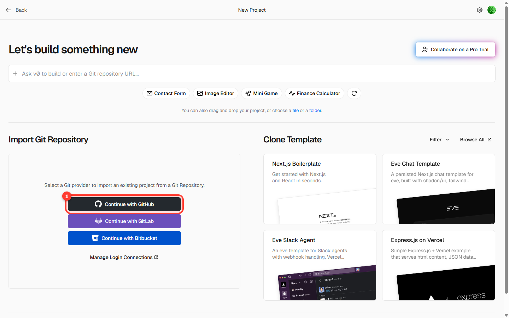

3. GitHub 화면으로 넘어가면 **Install / Authorize Vercel**(설치·허용)을 누릅니다.
   - 저장소 접근 범위는 **All repositories**(전체) 또는 **Only select repositories**(특정 저장소만 — 우리 팀 저장소 선택) 중 하나를 고릅니다.

> **자주 나는 함정**: 만약 저장소를 가져오려 할 때 아래처럼 **"To link a GitHub repository, you need to install the GitHub integration first"** 라는 빨간 경고가 보이면, 그 저장소가 있는 계정(개인 계정 또는 조직)에 **Vercel 앱이 아직 설치 안 된 것**입니다. 위 1~3번처럼 그 계정에 Vercel을 한 번 설치하면 해결됩니다.

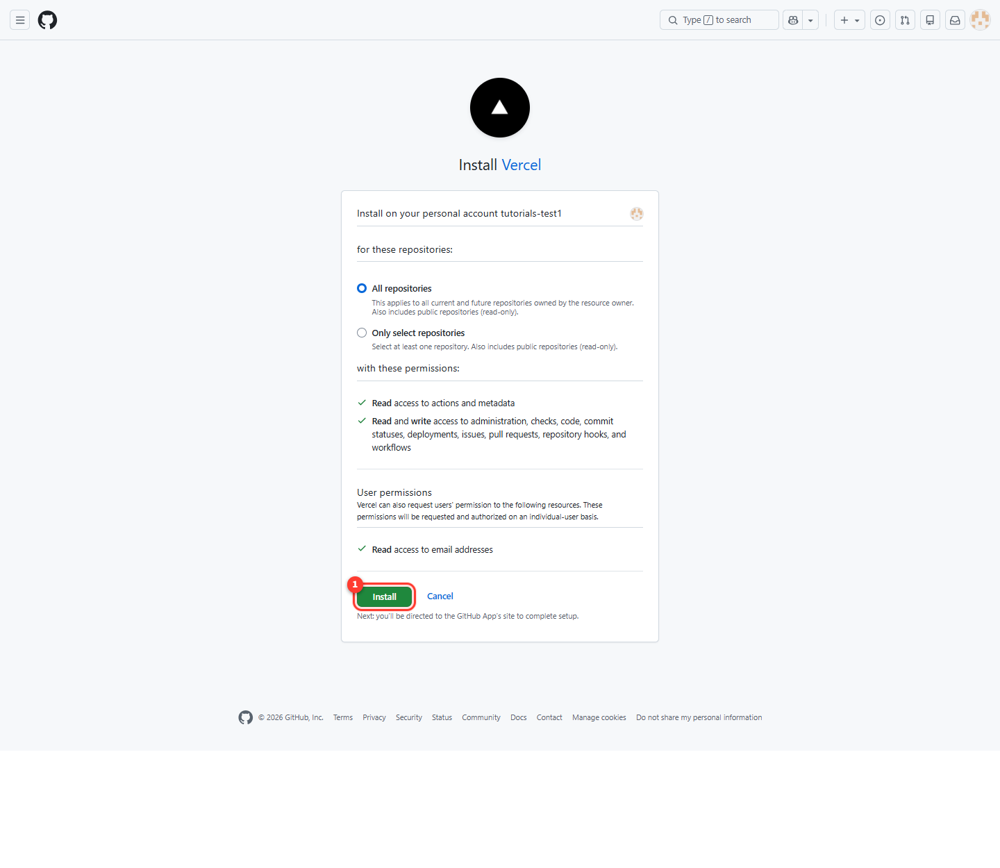

---

## 2단계 — 내 저장소 만들기 (미러링)

강사가 만들어 둔 튜토리얼 저장소를 **통째로 복사해서 내 저장소로 만드는** 과정입니다. 이걸 **미러링(mirroring)**이라고 합니다. Vercel은 **내 저장소**만 가져올 수 있고, 앞으로 코드를 고치려면 내 것이어야 하기 때문입니다.

1. GitHub 홈에서 왼쪽 위 초록색 **New**(새로 만들기) 버튼을 누릅니다.

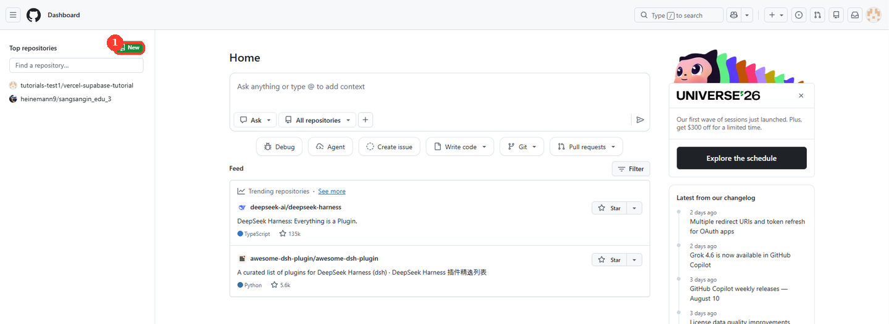
*① 초록색 New 버튼*

2. **Repository name**(저장소 이름)에 `vercel-test` 를 입력합니다. **이름은 `vercel-test` 로 맞춰주세요.**
3. 나머지 설정은 그대로 두고, 맨 아래 **Create repository**(저장소 만들기)를 누릅니다.

> **Add README·.gitignore·license는 켜지 마세요.** 완전히 비어 있는 저장소여야 다음 단계의 복사가 깔끔하게 들어갑니다.

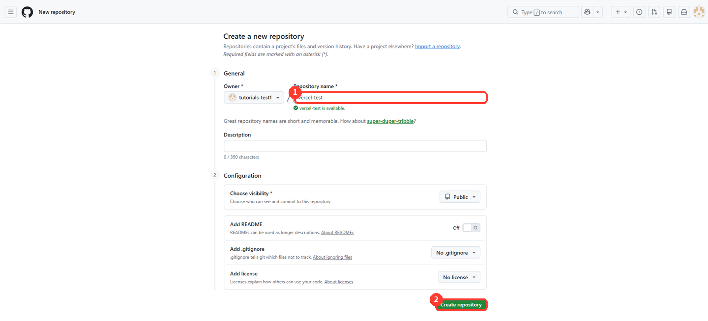
*① 저장소 이름은 vercel-test ② Create repository 버튼*

4. 저장소가 만들어지면 안내 화면이 나옵니다. 여기 있는 **HTTPS 주소**를 복사합니다. 이게 **내 저장소 주소**입니다.

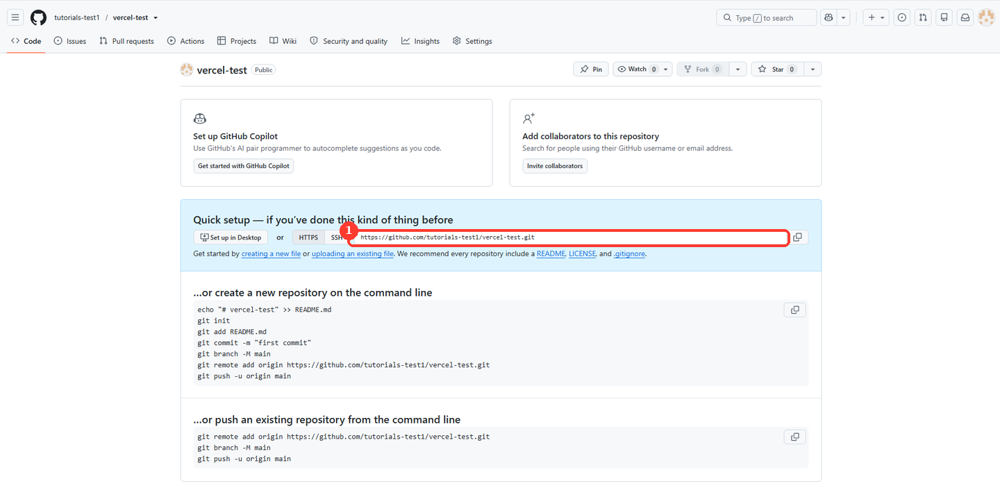
*① 복사할 내 저장소 주소*

5. Claude Code에 **강사가 알려준 원본 주소**와 **방금 복사한 내 저장소 주소**를 함께 주고, 복사(미러링)해 달라고 요청합니다.

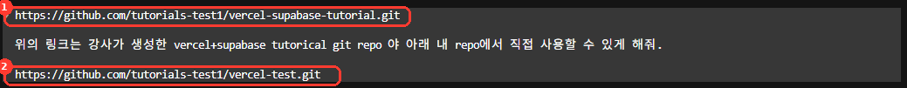
*① 강사가 만든 원본 저장소 (가져올 곳) ② 내가 방금 만든 저장소 (넣을 곳)*

> **두 주소를 헷갈리지 마세요.** **위**가 강사가 만든 **원본**(가져올 곳), **아래**가 방금 만든 **내 저장소**(넣을 곳)입니다. 순서가 바뀌면 엉뚱한 저장소를 덮어쓰게 됩니다.

6. 끝나면 내 저장소 페이지를 새로고침합니다. 파일 목록과 **브랜치·커밋**이 원본 그대로 들어와 있으면 성공입니다.

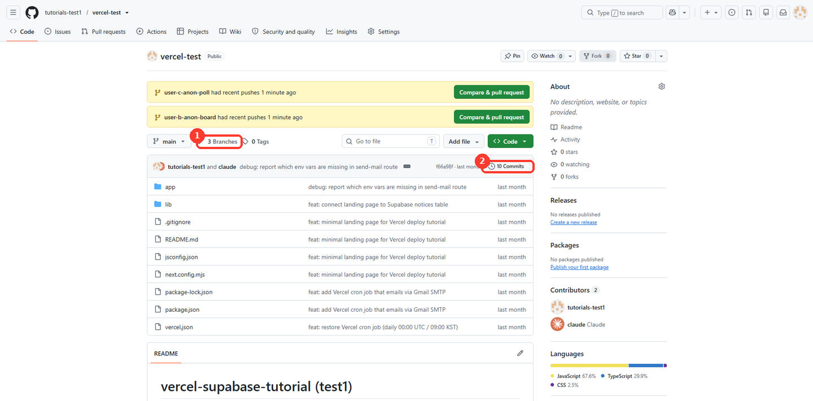
*① 브랜치와 ② 커밋이 원본 그대로 복사됨*

---

## 3단계 — 프로젝트 가져오기 (Import)

연결이 끝나면 우리 저장소를 고를 수 있습니다.

1. 저장소 목록(또는 검색)에서 우리 팀 저장소를 찾아 **Import**(가져오기)를 누릅니다.
2. 아래 설정 화면이 나옵니다. **대부분 그대로 두면 됩니다.**
   - **Vercel Team / Project Name**: 그대로 두기 (프로젝트 이름만 원하면 바꿔도 됨)
   - **Application Preset**: 보통 자동으로 **Next.js** 등 우리 프로젝트에 맞게 잡힙니다. 그대로 두기.
   - **Root Directory**: `./` 그대로 두기.

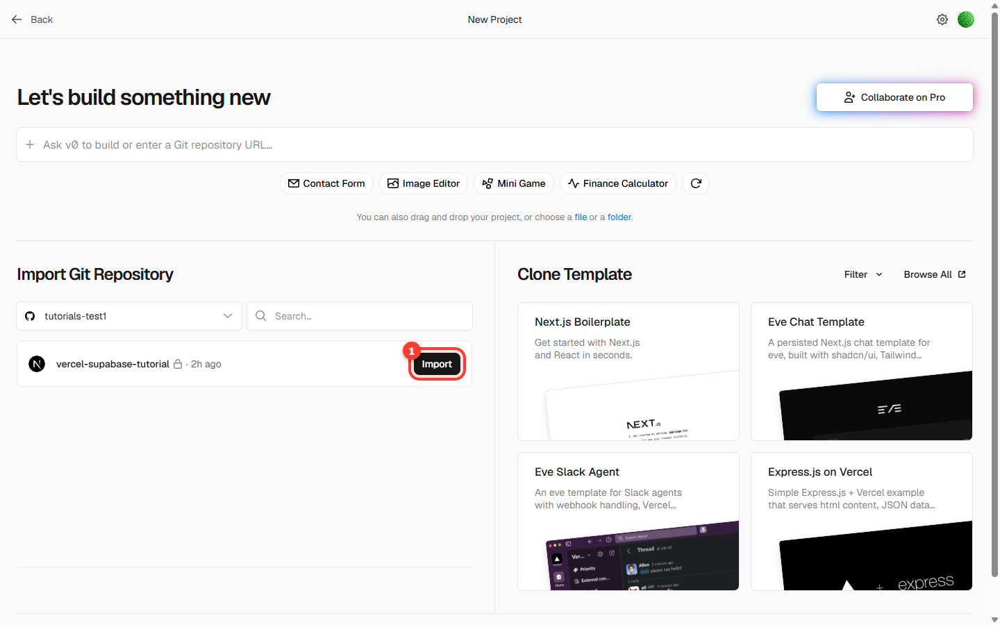

> 프레임워크가 자동으로 안 잡히면(Other로 표시되면) **Application Preset**만 우리 프로젝트에 맞게 골라줍니다. 잘 모르겠으면 강사에게 화면을 보여주세요.

---

## 4단계 — 배포하기 (Deploy)

1. 맨 아래 **Deploy**(배포) 버튼을 누릅니다.
2. 잠시 빌드(사이트를 만드는 과정)가 돌아갑니다. **1~2분 정도 기다리면 됩니다.**

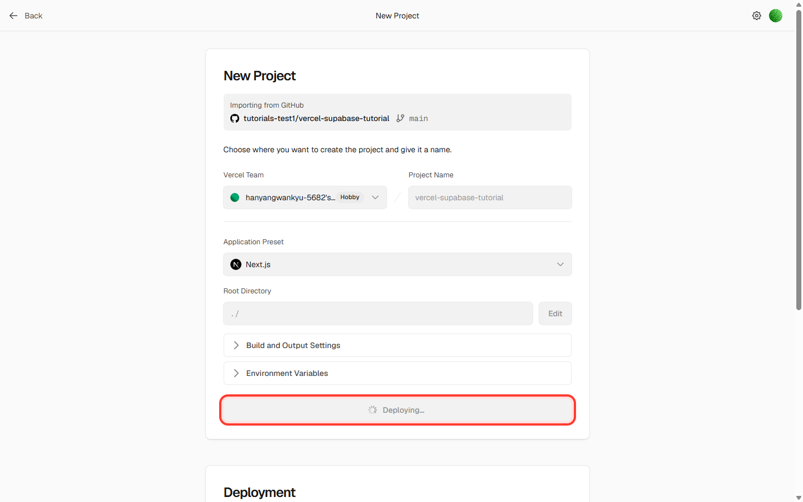

3. 끝나면 **Congratulations!**(축하합니다!) 화면과 함께 우리 사이트 미리보기가 보입니다.

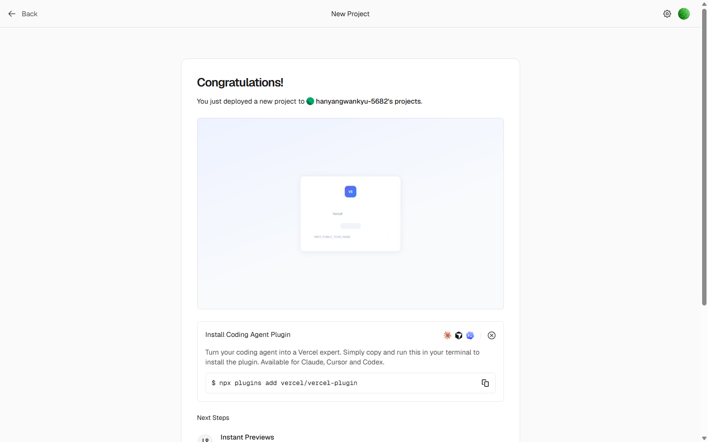

> **빌드 실패(빨간 글씨)가 나도 당황하지 마세요.** 에러 메시지에 보통 답이 있습니다(오타·빠진 파일 등). 막히면 강사와 함께 메시지를 읽어봅니다. 일단 여기서는 "주소가 나오는 것"이 목표입니다.

---

## 5단계 — 배포된 사이트 확인

1. 축하 화면에서 **Continue to Dashboard**(대시보드로 이동)를 누릅니다.
2. 프로젝트 대시보드에서 우리 사이트 주소 **`...vercel.app`** 을 확인할 수 있습니다.

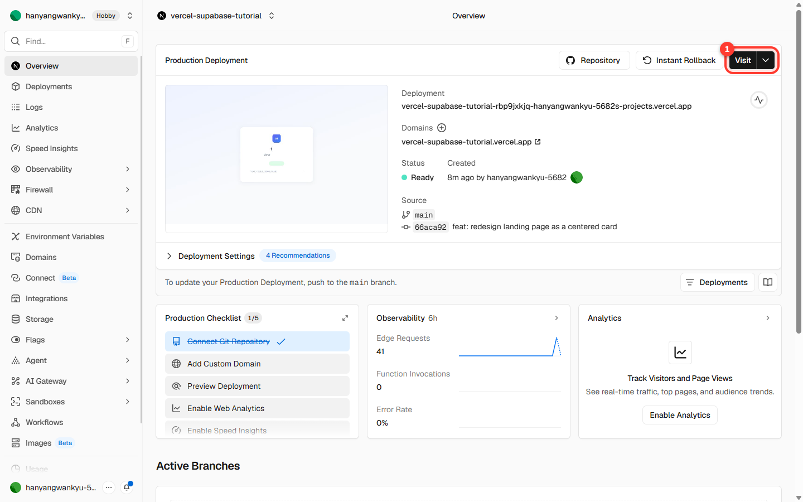

3. 그 주소를 눌러(또는 휴대폰으로) 열어봅니다. **내 컴퓨터가 아닌 곳에서도 보이는** 진짜 인터넷 사이트입니다.


> 위 예제 사이트는 아직 환경변수를 안 넣어서 **"우리 팀 사이트"** 라는 기본값이 보이고, "아직 설정 안 됨"이라고 표시됩니다. 다음 단계에서 이걸 바꿔봅니다.

---

## 6단계 — 환경변수 넣기

**환경변수**는 비밀번호·열쇠처럼 **코드에 직접 쓰면 안 되는 값**, 또는 **상황에 따라 바꾸고 싶은 값**을 따로 보관하는 곳입니다. 여기서는 화면에 보일 팀 이름을 환경변수로 넣어봅니다.

1. 프로젝트 화면 왼쪽 메뉴에서 **Settings → Environment Variables**(환경변수)로 들어갑니다. 처음엔 비어 있습니다.

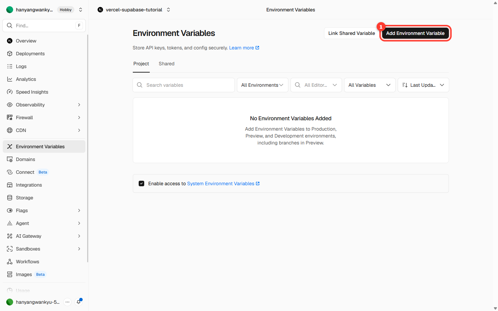

2. 오른쪽 위 **Add Environment Variable**(환경변수 추가)를 누릅니다.
3. 입력칸을 채웁니다.
   - **Key**(이름): `NEXT_PUBLIC_TEAM_NAME`
   - **Value**(값): `1조` (여러분 팀 이름)

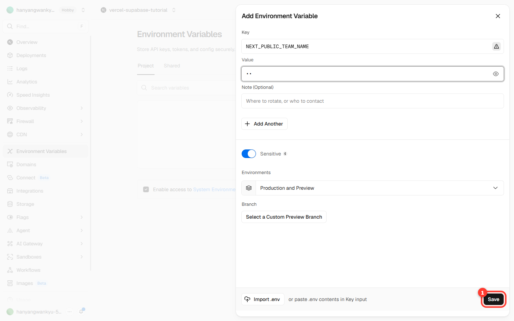

4. **Save**(저장)를 누릅니다. 목록에 변수가 보이고, "**새 배포가 필요하다**(A new deployment is needed)"는 안내가 뜹니다.

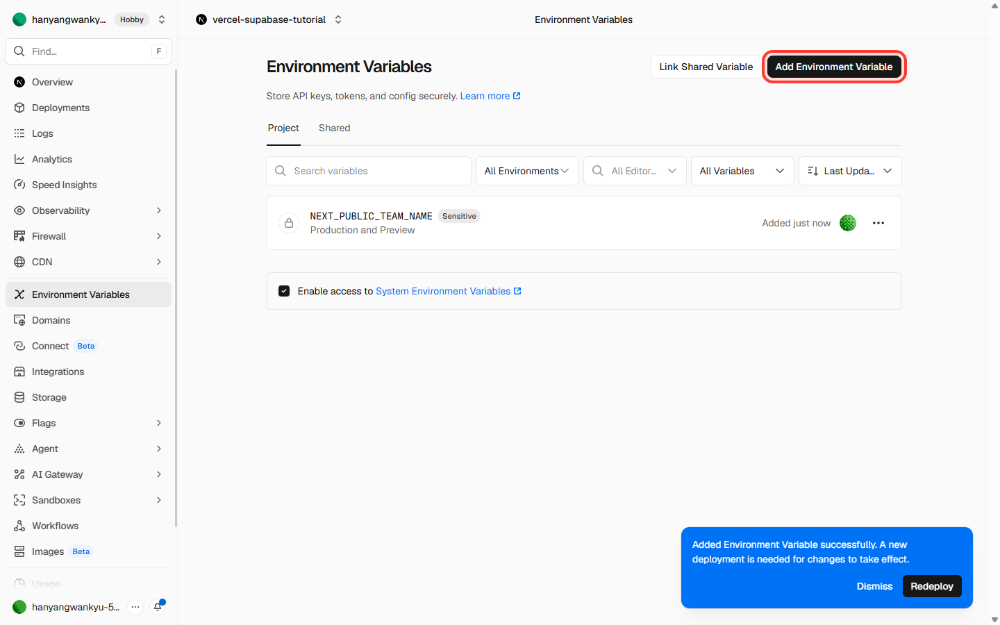

> **중요**: 환경변수는 **저장만으로는 화면에 바로 반영되지 않습니다.** 값을 적용하려면 **다시 배포(재배포)** 해야 합니다. 다음 단계입니다.

---

## 7단계 — 다시 배포하기 (Redeploy)

1. 왼쪽 메뉴 **Deployments**(배포)로 갑니다.
2. 맨 위 배포 줄 오른쪽의 **⋯**(더보기) 버튼을 누르고 **Redeploy**(재배포)를 선택합니다.

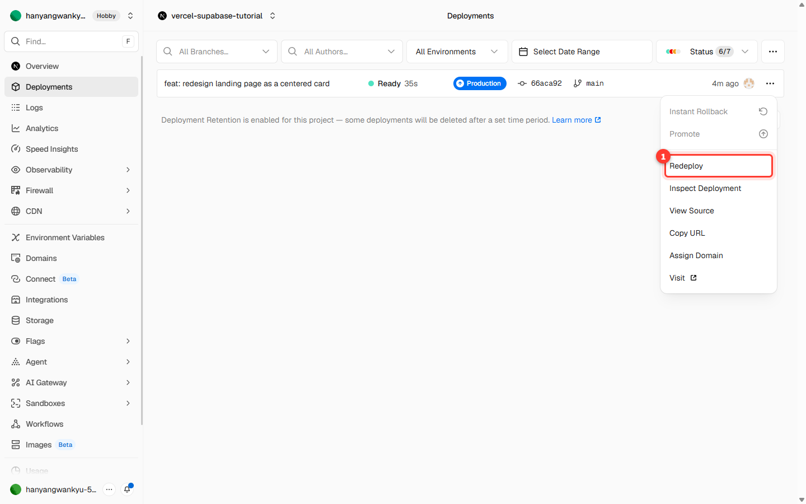

3. 확인 창이 뜨면 그대로 **Redeploy**를 누릅니다. (Build Cache 체크는 안 해도 됩니다.)

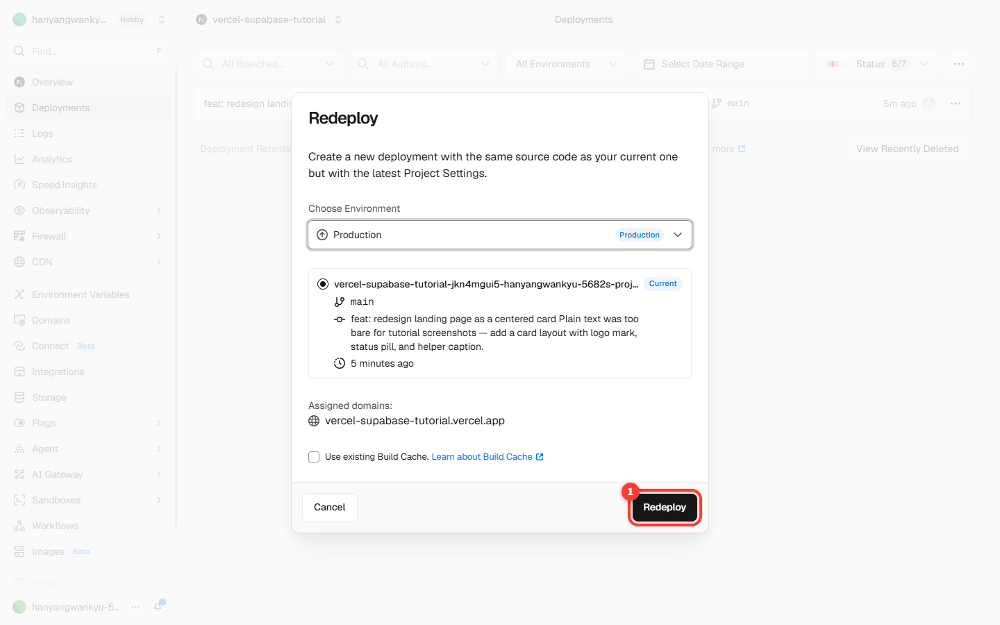

4. 다시 1~2분 기다립니다.

---

## 8단계 — 결과 확인

재배포가 끝나면 사이트 주소를 새로고침합니다. 팀 이름이 **방금 넣은 값("1조")으로 바뀌어** 있습니다.

| 환경변수 넣기 전 | 환경변수 넣고 재배포 후 |
|------------------|--------------------------|
| "우리 팀 사이트" (기본값) | **"1조 사이트"** (환경변수 적용) |

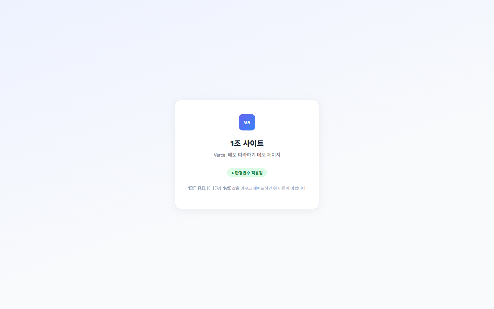

여기까지 왔으면 성공입니다. 직접 만든 사이트를 인터넷에 올리고, 환경변수로 내용까지 바꿔본 것입니다.

---

## 보너스 — 자동 재배포

GitHub 저장소에 **코드를 수정해서 올리면(push)**, Vercel이 **자동으로 다시 배포**합니다. 따로 Deploy를 누르지 않아도 됩니다.

- 2회차에서 하던 것처럼 코드를 고치고 GitHub에 올리면, Deployments 목록에 새 배포가 자동으로 생깁니다.
- 즉, 한 번 연결해두면 그다음부터는 "고치고 올리기"만 하면 사이트가 알아서 최신으로 갱신됩니다.

---

## 자주 막히는 곳 (체크리스트)

| 증상 | 원인 | 해결 |
|------|------|------|
| 저장소 목록에 우리 저장소가 안 보임 | Vercel 앱이 그 계정/조직에 설치 안 됨 | 1단계처럼 해당 계정에 Vercel 설치 (All 또는 해당 저장소 선택) |
| "install the GitHub integration first" 빨간 경고 | 같은 원인 (앱 미설치) | 위와 동일 |
| 배포는 됐는데 흰 화면 | 빌드는 됐지만 실행 중 오류 | 강사와 함께 로그(Logs) 확인 |
| 환경변수 넣었는데 화면이 그대로 | 재배포를 안 함 | 7단계 재배포 |
| 코드 고쳤는데 사이트가 안 바뀜 | GitHub에 push가 안 됨 | GitHub에 올라갔는지 확인 후 재배포 |

---

## 강사 메모

- 본 문서의 스크린샷은 데모 저장소 `sangsangin-vercel-demo`(최소 Next.js 예제)로 캡처했습니다. 화면이 단순해 비개발자도 각 단계를 또렷이 따라가도록 구성했습니다.
- 핵심 체크포인트: **4단계(배포 주소 확보)** 와 **8단계(환경변수 반영 확인)**. 막힌 팀은 이 두 지점을 기준으로 따라잡힙니다.
- 1단계(GitHub 연결·설치)가 실제 현장에서 가장 자주 막히는 지점입니다. 계정/조직 선택과 저장소 접근 범위를 화면 공유로 함께 짚어주세요.
- 상세 진행안(교시별 강사 가이드)은 [Curriculum.md](Curriculum.md) 참조.
